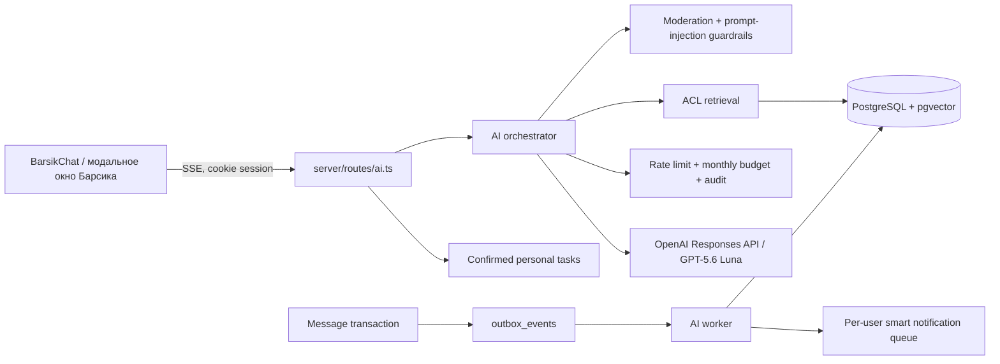

# Барсик ИИ: dev-пилот

## Статус

ИИ доступен только в development. Production не монтирует `/api/ai`, не запускает AI-миграцию и не содержит worker. Единственный внешний провайдер — OpenAI GPT-5.6 Luna (`gpt-5.6-luna`). Llama и переключатель провайдеров намеренно отсутствуют.

Модель работает только в режиме чтения. Серверная функциональность пилота включает:

- поиск по доступным сообщениям;
- сводка явно выбранного чата;
- «Что я пропустил?» по непрочитанным выбранного чата или за последние сутки;
- отдельные важные факты, решения, вопросы, сроки и ответственные;
- подготовка черновика в коротком, официальном, дружелюбном или подробном стиле без отправки;
- извлечение задач и решений с сохранением в личный список только отдельным подтверждающим запросом;
- группировка новых сообщений в одно умное уведомление на чат;
- ссылки на реальные сообщения-источники.

Отправка, удаление и пересылка не предоставлены модели. Черновик нельзя отправить через AI API. Предложенная задача не сохраняется автоматически: клиент должен отдельно вызвать `POST /api/ai/tasks`, а повтор запроса безопасен благодаря `clientId`.

## Серверные контракты

Пока UX/UI не утверждён, функции доступны как dev API:

- `POST /api/ai/stream`: режимы `search`, `summary`, `catchup`, `draft`, `tasks`, `notification`; результат передаётся SSE;
- `catchup` поддерживает `scope: conversation | day`, `since` и ссылки на просмотренные исходные сообщения;
- `draft` поддерживает `draftStyle: short | formal | friendly | detailed`;
- `GET/POST/PATCH/DELETE /api/ai/tasks`: личный список подтверждённых задач;
- `GET /api/ai/notifications/pending`: одно агрегированное событие на чат с количеством сообщений и упоминаний;
- `POST /api/ai/notifications/ack`: помечает вошедшие в сводку сообщения просмотренными.

Даже при отсутствии ключа Luna задачи и очередь уведомлений остаются доступны в dev. Генерация через `/stream` в этом случае отвечает `503` и не делает скрытого fallback к другой модели.

## Безопасное подключение Luna

Ранее опубликованный в переписке ключ необходимо отозвать. Создайте новый ключ и храните его только в окружении dev-сервера. Не добавляйте его в GitHub, клиентский `VITE_*`, Dockerfile или логи.

```powershell
Copy-Item .env.example .env.development
# В .env.development установите AI_ENABLED=true и новый OPENAI_API_KEY.
docker compose --env-file .env.development -p barsikchat-dev -f compose.dev.yml up --build
```

`.env*` исключены из Git и Docker build context, кроме безопасного `.env.example`.

## Архитектура



Новые модули изолированы в `server/routes`, `server/services`, `server/repositories` и `server/ai`; AI-код не добавлен в существующий монолит маршрутов.

## Граница доступа

Фрагменты выбираются до обращения к Luna:

- обязательна актуальная запись в `conversation_members`;
- удалённые, истёкшие, скрытые и одноразовые сообщения исключаются;
- удаление сообщения каскадно удаляет его AI-фрагменты;
- личный чат доступен только при явном `conversationId` и никогда не входит в общий поиск;
- после удаления участника ACL прекращает доступ без ожидания переиндексации;
- citations принимаются только из реально переданного модели списка источников, подпись источника формирует сервер.
- `sourceId` у решений, сроков и задач повторно проверяется сервером; выдуманные моделью идентификаторы заменяются на `null`;
- очередь уведомлений формируется отдельно для каждого текущего участника с учётом mute/mentions и очищается при удалении сообщения или участника.

Текст сообщений и файлов не записывается в `ai_audit_log`: хранятся SHA-256 запроса, идентификаторы источников, статус, токены, стоимость и очищенный код ошибки. Responses вызывается с `store: false` и псевдонимизированным `safety_identifier`.

## Обработка файлов

На первом пилоте Барсик не открывает содержимое файлов и никогда не распаковывает ZIP/RAR. Индексируется только имя, MIME и размер прикреплённого файла. Одноразовые файлы не индексируются. Активный HTML/SVG/JS/XML запрещён при загрузке, неизвестные типы скачиваются как `application/octet-stream`, а личная квота по умолчанию — 500 МБ.

## Надёжность и стоимость

- `outbox_events` записывается триггерами в одной транзакции с сообщением;
- worker использует `FOR UPDATE SKIP LOCKED`, повторные попытки и terminal failure после 8 ошибок;
- миграции сериализованы advisory lock, поэтому web и worker безопасно стартуют одновременно;
- таймаут Luna по умолчанию 45 секунд, 3 попытки только для временных HTTP-ошибок;
- circuit breaker выключает вызовы на минуту после трёх сбоев;
- лимит 8 запросов в минуту на пользователя и месячный бюджет $5, оба настраиваются ENV;
- API-ключ и полные приватные сообщения не попадают в аудит.

## Backup и восстановление dev

Сервис `backup` сразу создаёт PostgreSQL dump и архив пользовательских файлов, затем повторяет это ежедневно; локальная история хранится 7 дней. Проверка восстановления выполняется отдельно:

```bash
npm run backup:verify
```

Backup не считается рабочим, пока эта команда не завершилась сообщением `Development backup restored successfully`.

## Проверки

```bash
npm run typecheck
npm test
npm run build
npm run smoke
npm run smoke:ai
npm audit --audit-level=high
docker compose -p barsikchat-dev -f compose.dev.yml config --quiet
```

AI-smoke требует dev PostgreSQL с pgvector и запущенные web/worker. Он проверяет outbox, ACL чужого чата, исключение личных чатов из общего поиска, удаление из RAG, prompt injection, персональную очередь уведомлений, её подтверждение и идемпотентное создание личной задачи только из доступного источника. Unit-тесты дополнительно покрывают русский язык, структурированные сводки, стили черновика, проверку citations/sourceId, превышение бюджета, недоступность Luna, отмену и подтверждение потенциальных действий.

## Ограничения пилота

- настоящий ключ не включён в репозиторий, поэтому без серверной настройки UI показывает «Luna не подключена»;
- содержимое документов пока не разбирается;
- embedding-индекс создаётся worker, retrieval в пилоте также имеет безопасный полнотекстовый fallback;
- модель не выполняет действия;
- UI для новых режимов намеренно отложен: текущий интерфейс поиска, сводки и черновика остаётся совместимым с расширенным ответом;
- выкатывать AI в production до пилота на 5–10 коллегах и повторного security review запрещено.
