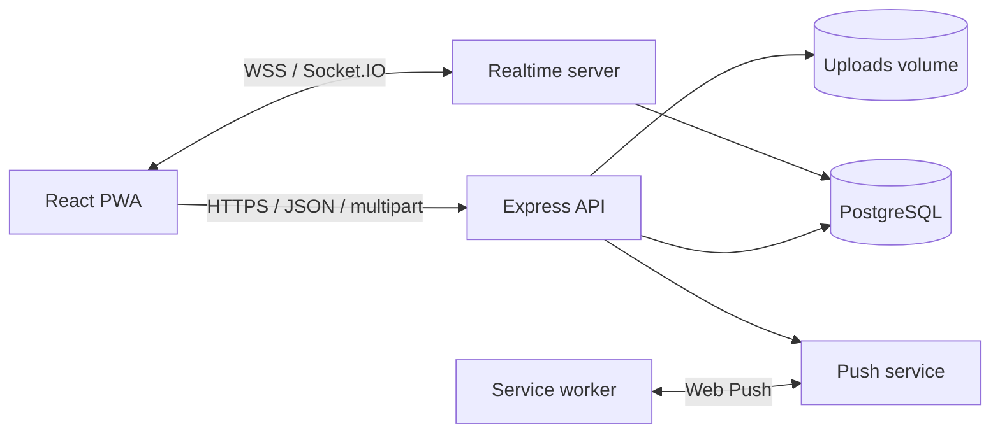

# Архитектура BarsikChat

## Обзор

BarsikChat — монолитное приложение с одним Node.js-процессом и отдельной PostgreSQL. Сервер одновременно отдаёт production-клиент, HTTP API и Socket.IO. Файлы хранятся вне базы в постоянном Docker volume.

Целевая конфигурация — один сервер и до 100 пользователей. Состояние присутствия и список Socket.IO-комнат находятся в памяти процесса, поэтому горизонтальное масштабирование требует общего Socket.IO-адаптера и общего rate-limit-хранилища.

## Клиент

Клиент находится в `src/` и собран на React + TypeScript + Vite.

- `App.tsx` загружает текущую сессию и переключает экран входа/мессенджера.
- `Messenger.tsx` управляет чатами, сообщениями, realtime-событиями и popup-уведомлениями.
- `MessageComposer.tsx` отвечает за текст, вложения, голос и видеокружки.
- модальные компоненты управляют профилем, группами, пересылкой и деталями чата.
- `api.ts` — типизированный fetch-клиент с cookie-сессией.
- `service-worker.ts` — precache статических ресурсов, NetworkFirst-навигация, push и маршрутизация между окнами.

React экранирует пользовательские строки. В проекте нет `dangerouslySetInnerHTML`, динамического `eval` или вставки пользовательского HTML.

## Сервер

Основные модули:

- `server/index.ts` — маршруты, валидация, загрузки и жизненный цикл;
- `server/auth.ts` — scrypt, сессии и middleware авторизации;
- `server/db.ts` — пул PostgreSQL, транзакции и миграции;
- `server/messages.ts` — единая SQL-проекция сообщения;
- `server/realtime.ts` — аутентификация Socket.IO, комнаты и presence;
- `server/push.ts` — Web Push;
- `server/security.ts` — origin-проверки и фильтрация push endpoint.

Все пользовательские значения перед SQL передаются параметрами. Транзакции используются для создания чатов, сообщений, пересылки и удаления связанных данных.

## Модель данных

| Таблица | Назначение |
|---|---|
| `users` | аккаунты, профиль, scrypt-хеш и ссылка на аватар |
| `sessions` | SHA-256-хеши случайных session tokens и срок действия |
| `conversations` | личные диалоги и группы |
| `conversation_members` | членство, роль, прочтение, mute, pin и скрытие |
| `messages` | текст, ответ, пересылка, редактирование и soft-delete |
| `attachments` | метаданные файлов и ссылка на физическое имя |
| `message_reactions` | реакции пользователей |
| `push_subscriptions` | Web Push endpoint и публичные ключи подписки |
| `schema_migrations` | применённые SQL-миграции |

`direct_key` гарантирует единственный личный диалог для пары пользователей. `client_id` вместе с отправителем обеспечивает идемпотентность повторной отправки сообщения.

## Авторизация

После регистрации или входа сервер создаёт 256-битный случайный токен. В браузер он попадает как `HttpOnly`, `SameSite=Lax`, `Secure` на HTTPS cookie. В базе хранится только SHA-256 токена.

HTTP-маршруты используют `requireAuth`. Socket.IO читает ту же cookie во время handshake и добавляет соединение только в комнаты пользователя и его текущих чатов. При выходе из группы все активные сокеты пользователя немедленно удаляются из комнаты.

## Жизненный цикл сообщения

1. Клиент загружает новые файлы в `/api/uploads` и получает временные attachment ID.
2. Клиент отправляет сообщение с `clientId` и attachment ID.
3. Сервер проверяет членство и владение временными файлами в одной транзакции.
4. После commit сообщение отправляется в Socket.IO-комнату и Web Push.
5. При удалении текст очищается, реакции удаляются, attachment-записи удаляются, а физический файл удаляется, если на него не ссылается пересланное сообщение.

Неиспользованные загрузки старше 24 часов очищаются при запуске приложения.

## Пересылка файлов

Пересылка создаёт новое сообщение и новые attachment-записи, но использует тот же физический `storage_name`. Поэтому файл не дублируется на диске. Удаление одного сообщения проверяет оставшиеся ссылки перед удалением файла.

## Realtime-события

Клиент подписывается на:

- `message:new`, `message:updated`;
- `conversation:new`, `conversation:updated`, `conversation:pinned`, `conversation:removed`;
- `read:update`, `typing:update`, `presence:update`, `profile:updated`.

Клиент отправляет `conversation:join`, `typing:start` и `typing:stop`. Сервер проверяет разрешённые комнаты, а членство изменяется вместе с REST-операциями.

## PWA и обновления

Vite PWA собирает service worker через `injectManifest`. Хешированные ресурсы precache-ятся, а HTML-навигация использует NetworkFirst. Новый service worker активируется сразу; клиент проверяет регистрацию при фокусе, изменении видимости и раз в минуту.

Push не скрывается из-за другого активного окна, если нужный чат там не просматривается. При клике окно с совпадающим `?chat=` имеет приоритет над активным окном с другим диалогом.

## Развёртывание

Production-образ многостадийный. Build-слой содержит компиляторы и npm, runtime-слой — только Node.js, production-зависимости и собранные файлы; npm удаляется после установки зависимостей. Контейнер работает от пользователя `node`, без Linux capabilities, с `no-new-privileges` и read-only root filesystem. Записывать можно только в volume `/app/data` и tmpfs `/tmp`.
